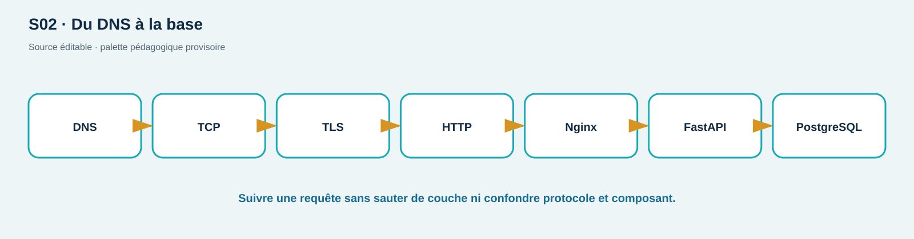

# TD01 — Autopsie d'une requête en panne

**Séance S02 · 90 min · C02 · Travail en binôme**

**Connexion au cours :** SL009–SL016 et chapitre S02. Réutilisez le trajet Browser → DNS → TCP → TLS → proxy → API → DB et marquez chaque frontière avant de proposer une correction.

## Situation

ShopLab fonctionne depuis l'hôte sur `https://127.0.0.1:8443`, mais le navigateur affiche une erreur après une modification du proxy. Vous disposez uniquement des extraits synthétiques suivants :

```text
curl: (60) SSL certificate problem: self-signed certificate
HTTP/1.1 502 Bad Gateway
X-Correlation-ID: td01-7f2
api | GET /api/health 200 correlation_id=td01-7f1
proxy | connect() failed (111: Connection refused) upstream: http://127.0.0.1:8000
```

Architecture déclarée : navigateur → proxy Nginx (edge) → API (core) → PostgreSQL (core interne). Le proxy et l'API sont dans deux conteneurs distincts.

## Consignes et productions

1. En 10 min, classez chaque ligne : DNS, TCP, TLS, HTTP, proxy, API ou DB. Séparez erreur bloquante, symptôme et information normale.
2. En 20 min, dessinez le flux aller/retour, les frontières et les points d'observation. Ajoutez le nom que chaque acteur doit résoudre.
3. En 20 min, formulez trois hypothèses falsifiables. Pour chacune : commande locale sûre, résultat attendu si vraie, résultat attendu si fausse. Aucun `-k` sans explication.
4. En 15 min, reconstituez la chronologie à partir des IDs `td01-7f1` et `td01-7f2`. Peut-on attribuer les lignes à la même requête ? Justifiez.
5. En 15 min, proposez la correction minimale et deux tests de non-régression (succès API et panne DB visible sans fuite).
6. En 10 min, rendez une note d'incident de 120 mots maximum : impact, cause probable, preuve manquante, action suivante.

<div class="page-break"></div>

## Garde-fous et critères

Exemple de **forme de preuve** attendue, sans donner la conclusion :

```text
Observation : proxy | connect() failed … upstream=…
Couche : proxy → amont
Hypothèse : …
Test local qui la réfute : …
Résultat attendu si l'hypothèse est fausse : …
```

Stop condition : toute commande visant une cible autre que `127.0.0.1` ou un service ShopLab déclaré est retirée du plan. Si deux lignes portent des identifiants différents, ne les fusionnez pas sans preuve supplémentaire.

Toutes les commandes proposées ciblent `127.0.0.1` ou les services du réseau Docker. Ne supposez pas que TLS, HTTP et santé métier sont équivalents. Une conclusion doit citer une preuve; sinon marquez-la « hypothèse ».

| Critère | Attendu | Points |
| --- | --- | ---: |
| Modèle de chaîne | aller/retour, noms, frontières | 5 |
| Diagnostic | hypothèses falsifiables et commandes sûres | 6 |
| Corrélation | IDs interprétés sans fusion abusive | 4 |
| Communication | correction/retests/note concise | 5 |

<!-- full-course-visual-runbooks -->

## Vue ShopLab avant de commencer



**Question du visuel :** où la donnée traverse-t-elle une frontière de confiance, quel composant décide et quel état doit être observé après l’action ?

| Élément | Lecture attendue |
| --- | --- |
| Zone étudiée | Browser → DNS/TLS → proxy → API |
| Direction | aller de la requête, puis retour statut/headers/corps/logs |
| Contrôle | placé au composant qui possède la décision, refus par défaut |
| État final | parcours légitime fonctionnel, cas négatif refusé, preuve expurgée |

## Bloc de commande important — méthode commune

1. **Goal** — observer ou modifier uniquement l’état annoncé pour `extraits de traces`.
2. **Before** — noter mode ShopLab, commit, services et baseline.
3. **Command** — exécuter exactement la commande du bloc concerné sur `127.0.0.1` ou le réseau Docker isolé.
4. **What happens inside the system** — suivre le nœud actif dans le diagramme, puis la décision et la trace générée.
5. **Expected output** — prédire statut, champ ou branche avant d’exécuter; ne pas fabriquer une sortie.
6. **Small diagram or highlighted architecture** — entourer sur le visuel le composant qui change ou révèle son état.
7. **How to verify** — répéter le test négatif et le parcours légitime avec le même contexte documenté.
8. **Evidence to save** — hypothèse falsifiable; UTC, commande, sortie minimale, conclusion et limite.
9. **If it fails** — arrêter si la cible sort du lab; sinon vérifier une seule frontière à la fois et consigner l’écart.
10. **Next step** — indexer la preuve, effectuer le debrief demandé, puis `reset`/`cleanup`.
