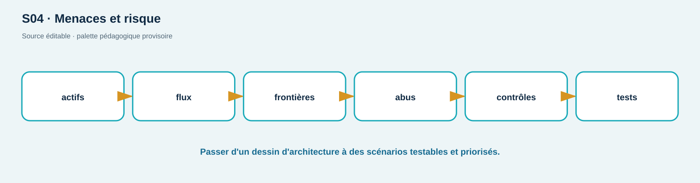

# TD02 — Modèle de menace du checkout ShopLab

**Séance S04 · 90 min · C01, C04 · Groupes de 3–4**

## Situation

Le nouveau checkout reçoit un panier JSON, lit le prix produit en base, appelle un simulateur de livraison interne, crée la commande et émet un reçu. Le navigateur conserve une session cookie. L'équipe propose aussi un champ `callback_url`. Tout est encore local et synthétique.

**Connexion au cours :** SL025–SL032 et chapitre S04. Vous partez du trajet vu en S02–S03, puis vous transformez chaque frontière en question de confiance, contrôle et preuve.

## Actifs et contraintes imposées

Actifs candidats : identité/session, prix, commande, disponibilité, preuve d'achat, journal d'audit. Frontières minimales : navigateur non fiable, proxy edge, API, DB interne, service livraison. Les tests offensifs doivent rester dans ShopLab; le callback réel est remplacé par `/api/url-check` sans fetch.

## Atelier

1. **Inventaire (10 min).** Priorisez cinq actifs selon confidentialité/intégrité/disponibilité et justifiez le premier.
2. **DFD (20 min).** Dessinez processus, magasins, flux bidirectionnels, protocoles et frontières. Marquez données contrôlées par le client.
3. **Abus (20 min).** Produisez six scénarios distincts couvrant au moins : BOLA, modification de prix/mass assignment, CSRF, SSRF, rejeu de session et indisponibilité. Format : précondition → action → impact.
4. **Contrôles (15 min).** Pour chaque scénario, choisissez contrôle préventif, détectif et test de vérification. Placez le contrôle au composant responsable.
5. **Priorisation (15 min).** Notez vraisemblance et impact sur 1–4, calculez le score, puis ajustez une priorité avec une justification métier. La matrice ne remplace pas le raisonnement.
6. **Scope (10 min).** Rédigez règles d'engagement, stop conditions, preuves autorisées et éléments explicitement hors scope.

### Format attendu — exemple partiel, pas une solution

```text
TM-S04-__
Précondition : [identité / état nécessaire]
Action : [donnée ou opération contrôlée]
Comportement à vérifier : [décision du composant]
Impact : [actif + propriété touchée]
Contrôle placé dans : [proxy / API / DB / navigateur]
Test : [cas légitime] / [cas refusé] / [résultat observable]
```

Le DFD doit se lire de gauche à droite. Étiquetez chaque flèche avec la donnée ou le protocole et dessinez les frontières en pointillé rouge. Une capture du dessin est recevable si les libellés restent lisibles et si aucun nom, token ou cookie réel n'apparaît.

**Décision et arrêt :** `callback_url` est une entrée à modéliser, pas une invitation à contacter Internet. Utilisez uniquement `/api/url-check` sans fetch. Arrêtez si une cible externe, un secret réel ou un composant non prévu apparaît; conservez une trace minimale et prévenez le formateur.

**Dépannage papier :** si votre dessin devient illisible, revenez à cinq nœuds — acheteur, navigateur, proxy, API, base — puis ajoutez un flux à la fois. Si un contrôle n'a pas de test observable, reformulez le scénario avant de le prioriser.

## Livrable et barème /20

Un DFD lisible, registre de six menaces et plan de tests local. Aucune solution technique n'est acceptée sans menace liée et résultat observable.

Ajoutez au jalon `CAP04` une version datée du DFD et du registre. Le sujet réservé du capstone n'est pas public; ce jalon est seulement votre modèle de travail évolutif.

| Axe | Insuffisant | Conforme | Maîtrisé | Pts |
| --- | --- | --- | --- | ---: |
| DFD | composants sans flux | flux/frontières complets | confiance explicitée | 5 |
| Scénarios | noms OWASP | précondition/action/impact | diversité et chaîne d'abus | 6 |
| Contrôles/tests | checklist | contrôle au bon niveau | prévention+détection+retest | 6 |
| Scope | absent | local/stop/preuves | limites argumentées | 3 |

<!-- full-course-visual-runbooks -->

## Vue ShopLab avant de commencer



**Question du visuel :** où la donnée traverse-t-elle une frontière de confiance, quel composant décide et quel état doit être observé après l’action ?

| Élément | Lecture attendue |
| --- | --- |
| Zone étudiée | Acheteur → checkout → API → base |
| Direction | aller de la requête, puis retour statut/headers/corps/logs |
| Contrôle | placé au composant qui possède la décision, refus par défaut |
| État final | parcours légitime fonctionnel, cas négatif refusé, preuve expurgée |

## Bloc de commande important — méthode commune

1. **Goal** — observer ou modifier uniquement l’état annoncé pour `DFD + scénario d’abus`.
2. **Before** — noter mode ShopLab, commit, services et baseline.
3. **Command** — exécuter exactement la commande du bloc concerné sur `127.0.0.1` ou le réseau Docker isolé.
4. **What happens inside the system** — suivre le nœud actif dans le diagramme, puis la décision et la trace générée.
5. **Expected output** — prédire statut, champ ou branche avant d’exécuter; ne pas fabriquer une sortie.
6. **Small diagram or highlighted architecture** — entourer sur le visuel le composant qui change ou révèle son état.
7. **How to verify** — répéter le test négatif et le parcours légitime avec le même contexte documenté.
8. **Evidence to save** — frontières + contrôle + test; UTC, commande, sortie minimale, conclusion et limite.
9. **If it fails** — arrêter si la cible sort du lab; sinon vérifier une seule frontière à la fois et consigner l’écart.
10. **Next step** — indexer la preuve, effectuer le debrief demandé, puis `reset`/`cleanup`.
