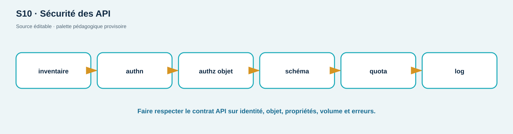

# TD03 — Revue contradictoire d'une API

**Séance S10 · 90 min · C06, C08, C09 · Jeu de rôles**

## Dossier

Une API de tickets expose :

```http
POST /api/login                    -> access_token, user
GET  /api/tickets/{id}             -> id, owner_id, title, internal_note
PATCH /api/users/me                <- JSON libre
POST /api/tickets/export           <- {"format":"pdf","callback_url":"..."}
```

Le proxy fait confiance à tout `X-Forwarded-For`, les erreurs de validation retournent la stack trace, le quota « 100/min » n'a pas de clé documentée et le token reste valide 24 h sans révocation. Le schéma OpenAPI accepte `additionalProperties: true`.

## Rôles

- équipe produit : préserver les cas d'usage et expliquer les contraintes ;
- équipe sécurité : construire des hypothèses testables et prioriser ;
- équipe exploitation : juger déploiement, logs, quota et rollback ;
- observateur : relever affirmations sans preuve et décisions.

## Travail demandé

1. Établissez en 15 min l'inventaire méthode/objet/sujet/propriétés/erreurs.
2. Écrivez en 20 min huit tests sous forme Given/When/Then, dont 200/401/403, mass assignment, champ excessif, quota avec vrai `429`, callback simulé et forwarded header.
3. Négociez en 20 min un contrat corrigé : schémas fermés, vues de réponse, autorisation objet, TTL/révocation, clé de quota, erreurs et trust proxy.
4. Définissez en 15 min six événements de journal avec champs utiles et interdits; aucun token/cookie/password.
5. Faites une revue contradictoire de 10 min : chaque équipe doit réfuter une hypothèse de l'autre par une preuve attendue.
6. Rendez en 10 min un ordre de correction P0/P1/P2 avec dépendances et rollback.

## Barème /20

| Critère | Points |
| --- | ---: |
| Inventaire et frontières sujet/objet/propriété | 5 |
| Tests observables, y compris négatifs | 6 |
| Contrat corrigé cohérent | 5 |
| Logs, priorisation et qualité du débat | 4 |

Les tests restent conceptuels ou dirigés vers ShopLab local; aucune URL externe n'est autorisée.

<!-- full-course-visual-runbooks -->

## Vue ShopLab avant de commencer



**Question du visuel :** où la donnée traverse-t-elle une frontière de confiance, quel composant décide et quel état doit être observé après l’action ?

| Élément | Lecture attendue |
| --- | --- |
| Zone étudiée | Client → API inventory → décision → logs |
| Direction | aller de la requête, puis retour statut/headers/corps/logs |
| Contrôle | placé au composant qui possède la décision, refus par défaut |
| État final | parcours légitime fonctionnel, cas négatif refusé, preuve expurgée |

## Bloc de commande important — méthode commune

1. **Goal** — observer ou modifier uniquement l’état annoncé pour `revue d’architecture`.
2. **Before** — noter mode ShopLab, commit, services et baseline.
3. **Command** — exécuter exactement la commande du bloc concerné sur `127.0.0.1` ou le réseau Docker isolé.
4. **What happens inside the system** — suivre le nœud actif dans le diagramme, puis la décision et la trace générée.
5. **Expected output** — prédire statut, champ ou branche avant d’exécuter; ne pas fabriquer une sortie.
6. **Small diagram or highlighted architecture** — entourer sur le visuel le composant qui change ou révèle son état.
7. **How to verify** — répéter le test négatif et le parcours légitime avec le même contexte documenté.
8. **Evidence to save** — décision priorisée; UTC, commande, sortie minimale, conclusion et limite.
9. **If it fails** — arrêter si la cible sort du lab; sinon vérifier une seule frontière à la fois et consigner l’écart.
10. **Next step** — indexer la preuve, effectuer le debrief demandé, puis `reset`/`cleanup`.
