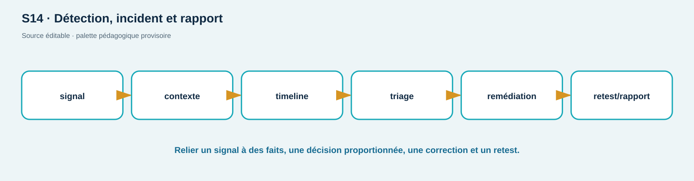

# TD04 — Cellule d'incident et rapport de clôture

**Séance S14 · 90 min · C01, C12 · Simulation sur données synthétiques**

## Déclencheur

À 09:14 UTC, ShopLab produit une hausse de `403` et cinq échecs login. À 09:16, un `200` sur `/api/users/2` apparaît depuis une session Alice dans le mode vulnérable. À 09:18, le service est passé en corrected. Un collègue affirme que « le proxy a bloqué l'attaque ».

```json
{"timestamp":"09:14:02Z","event":"authentication","result":"failed","username":"alice","correlation_id":"inc-01"}
{"timestamp":"09:16:11Z","event":"authorization","result":"allowed","subject_id":"1","object_id":2,"correlation_id":"inc-07","mode":"vulnerable"}
{"timestamp":"09:18:30Z","event":"http_request","result":"denied","status":403,"correlation_id":"inc-09","mode":"corrected"}
```

## Mission par injects

1. **Triage, 15 min :** faits/hypothèses/inconnues, sévérité provisoire, scope, stop conditions.
2. **Inject A, 15 min :** on vous demande le token complet « pour enquêter ». Refusez et proposez une preuve expurgée équivalente.
3. **Chronologie, 15 min :** construisez une ligne UTC avec source et niveau de confiance. Dites ce que les extraits ne prouvent pas.
4. **Confinement, 15 min :** choisissez trois actions réversibles et ordonnées; distinguez mode corrected, révocation de session et correction source.
5. **Validation, 15 min :** planifiez retests 200/401/403, recherche de logs, non-régression et cleanup. Définissez le critère de retour au service.
6. **Communication, 15 min :** résumé dirigeant (100 mots) et annexe technique (preuves, cause, correction, limites, actions).

## Règles

Aucune preuve ne contient token/cookie/password. Ne déclarez pas une compromission externe ni une attribution. Les lignes sont synthétiques. Un mode corrigé n'est pas à lui seul une analyse de cause ni une preuve de déploiement production.

## Barème /20

| Axe | Insuffisant | Conforme | Maîtrisé | Pts |
| --- | --- | --- | --- | ---: |
| Triage | conclusions hâtives | faits/hypothèses séparés | confiance et sévérité révisables | 5 |
| Preuve | secret copié | expurgation/chaîne | preuve minimale reproductible | 4 |
| Réponse/retest | action unique | confinement/correction/retest | rollback et critères | 6 |
| Communication | jargon/attribution | deux audiences | limites et décisions claires | 5 |

<!-- full-course-visual-runbooks -->

## Vue ShopLab avant de commencer



**Question du visuel :** où la donnée traverse-t-elle une frontière de confiance, quel composant décide et quel état doit être observé après l’action ?

| Élément | Lecture attendue |
| --- | --- |
| Zone étudiée | Signal → timeline → décision → remédiation → retest |
| Direction | aller de la requête, puis retour statut/headers/corps/logs |
| Contrôle | placé au composant qui possède la décision, refus par défaut |
| État final | parcours légitime fonctionnel, cas négatif refusé, preuve expurgée |

## Bloc de commande important — méthode commune

1. **Goal** — observer ou modifier uniquement l’état annoncé pour `journal d’incident`.
2. **Before** — noter mode ShopLab, commit, services et baseline.
3. **Command** — exécuter exactement la commande du bloc concerné sur `127.0.0.1` ou le réseau Docker isolé.
4. **What happens inside the system** — suivre le nœud actif dans le diagramme, puis la décision et la trace générée.
5. **Expected output** — prédire statut, champ ou branche avant d’exécuter; ne pas fabriquer une sortie.
6. **Small diagram or highlighted architecture** — entourer sur le visuel le composant qui change ou révèle son état.
7. **How to verify** — répéter le test négatif et le parcours légitime avec le même contexte documenté.
8. **Evidence to save** — chaîne de preuves; UTC, commande, sortie minimale, conclusion et limite.
9. **If it fails** — arrêter si la cible sort du lab; sinon vérifier une seule frontière à la fois et consigner l’écart.
10. **Next step** — indexer la preuve, effectuer le debrief demandé, puis `reset`/`cleanup`.
