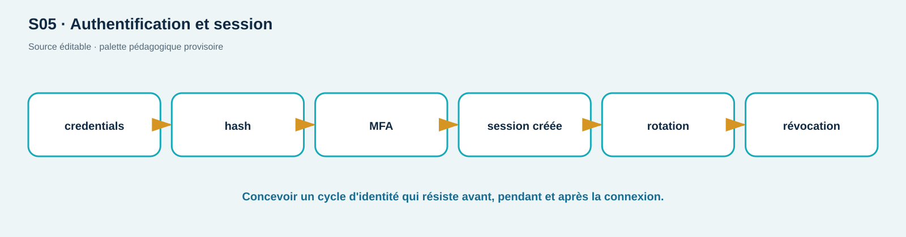

# TP02 — Session, cookie, rotation, logout et CSRF

**Séances :** S03/S05 · **Durée :** 180 min · **Compétences :** C03, C05 · **Niveau :** guidé puis autonome

## Contrat, objectifs et prérequis

Seulement ShopLab sur `127.0.0.1`; comptes synthétiques. Ne publiez ni token, ni cookie, ni mot de passe, même ceux du lab. Vous allez comparer Bearer/cookie, observer les attributs, prouver rotation et révocation, puis vérifier une défense CSRF. TP01 et un lab sain sont requis.

**Connexion au cours :** SL017–SL024 et chapitre S03 préparent la partie A. Commencez par annoter la transaction HTTP et les décisions navigateur/serveur; la rotation, le logout et CSRF seront approfondis en S05.

## Livrables

Une chronologie de session expurgée, un tableau `contrôle → attaque → résultat → interprétation`, les statuts attendus et une proposition de correction. Réussite : login `200`, absence `401`, CSRF refusé `403`, rotation invalide l'ancien identifiant et logout empêche la réutilisation.

## Mise en place (15 min)

```bash
cd labs/shoplab
./scripts/reset.sh
mkdir -p preuves/TP02
base=http://127.0.0.1:${SHOPLAB_HTTP_PORT:-8080}
```

## A — Authentification et cookie (35 min)

```bash
curl -sS -D preuves/TP02/login.headers -c preuves/TP02/cookies.txt \
  -H 'Content-Type: application/json' \
  -d '{"username":"alice","password":"atelier-alice"}' \
  "$base/api/auth/login" > preuves/TP02/login.json
```

Avant remise, remplacez les valeurs de `Set-Cookie`, `access_token` et `csrf_token` par `[EXPURGÉ]`. Identifiez `HttpOnly`, `Secure`, `SameSite`, portée et durée. Expliquez quelles attaques chaque attribut réduit et lesquelles restent possibles.

Exemple synthétique du **format** attendu :

```text
Host: 127.0.0.1:8080               → destination HTTP
Origin: absent avec curl            → politique navigateur non exercée
Set-Cookie: session=[EXPURGÉ]; …    → attributs évalués, valeur retirée
HTTP 200                            → login accepté, pas « tout est sûr »
```

Décision : si une valeur sensible apparaît dans une capture, ne la remettez pas. Expurgez la copie, régénérez l'index et conservez seulement les attributs nécessaires à l'analyse.

## B — Cycle de session (40 min)

Extrayez temporairement les valeurs avec Python, sans les afficher :

```bash
token=$(python3 -c 'import json; print(json.load(open("preuves/TP02/login.json"))["access_token"])')
curl -sS -o /dev/null -w 'absent=%{http_code}\n' "$base/api/users/1"
curl -sS -o /dev/null -w 'bearer=%{http_code}\n' -H "Authorization: Bearer $token" "$base/api/users/1"
curl -sS -b preuves/TP02/cookies.txt -c preuves/TP02/rotated.txt \
  -X POST "$base/api/auth/refresh" -o preuves/TP02/refresh.json -w 'refresh=%{http_code}\n'
```

Comparez les identifiants `jti` uniquement par empreinte SHA-256 tronquée. Vérifiez que l'ancien token est refusé après rotation.

## C — CSRF local (45 min)

L'endpoint `/api/profile/display-name` accepte une session cookie et modifie l'état. En mode vulnérable, tentez un POST sans `X-CSRF-Token`; en mode corrigé, répétez, puis fournissez le token double-submit renvoyé au login.

```bash
./scripts/set-mode.sh vulnerable
# reconnectez-vous, puis test sans header CSRF
./scripts/set-mode.sh corrected
# reconnectez-vous, test sans puis avec X-CSRF-Token
```

Attendus : vulnérable `200`; corrigé sans token `403`; corrigé avec token correspondant `200`. Expliquez pourquoi CORS ne remplace pas CSRF et pourquoi une requête modifiant l'état ne doit pas être un GET.

## D — Logout et journalisation (25 min)

Appelez `POST /api/auth/logout` avec le cookie et le header CSRF. Réutilisez ensuite l'ancien Bearer : attendu `401`. Recherchez par identifiant de corrélation dans `docker compose logs api`, sans copier d'identifiant d'authentification.

## Vérification, reset, cleanup (25 min)

```bash
./scripts/verify-lab.sh session
./scripts/reset.sh
./scripts/cleanup.sh
```

`verify-lab.sh session` doit produire PASS pour cookie, CSRF, rotation et logout; son trap supprime ses fichiers temporaires. `cleanup.sh` supprime ensuite le projet Compose et l'état local jetable.

## Dépannage et plateformes

PowerShell : utilisez `Invoke-WebRequest -SessionVariable`; WSL2/macOS/Linux : `curl` tel qu'indiqué. Un cookie `Secure` n'est pas renvoyé sur HTTP en mode corrigé : utilisez l'URL HTTPS avec le certificat local (`curl -k`) ou testez le Bearer. Un `401` après un changement de mode est normal : le service est recréé et les sessions sont invalidées.

## Barème /20

| Critère | Insuffisant | Conforme | Maîtrisé | Pts |
| --- | --- | --- | --- | ---: |
| Cycle de session | login seul | création/rotation/logout prouvés | états et limites expliqués | 6 |
| Cookies | valeurs publiées ou confusion | attributs correctement interprétés | compromis contextualisés | 4 |
| CSRF | payload sans preuve | 200/403/retest | CORS/SOP/SameSite articulés | 6 |
| Preuves/cycle lab | non expurgé/résidus | preuves et cleanup | index reproductible | 4 |

<!-- full-course-visual-runbooks -->

## Vue ShopLab avant de commencer



**Question du visuel :** où la donnée traverse-t-elle une frontière de confiance, quel composant décide et quel état doit être observé après l’action ?

| Élément | Lecture attendue |
| --- | --- |
| Zone étudiée | Browser → login → session → rotation → logout |
| Direction | aller de la requête, puis retour statut/headers/corps/logs |
| Contrôle | placé au composant qui possède la décision, refus par défaut |
| État final | parcours légitime fonctionnel, cas négatif refusé, preuve expurgée |

## Bloc de commande important — méthode commune

1. **Goal** — observer ou modifier uniquement l’état annoncé pour `login + cookie + requête CSRF`.
2. **Before** — noter mode ShopLab, commit, services et baseline.
3. **Command** — exécuter exactement la commande du bloc concerné sur `127.0.0.1` ou le réseau Docker isolé.
4. **What happens inside the system** — suivre le nœud actif dans le diagramme, puis la décision et la trace générée.
5. **Expected output** — prédire statut, champ ou branche avant d’exécuter; ne pas fabriquer une sortie.
6. **Small diagram or highlighted architecture** — entourer sur le visuel le composant qui change ou révèle son état.
7. **How to verify** — répéter le test négatif et le parcours légitime avec le même contexte documenté.
8. **Evidence to save** — chronologie expurgée; UTC, commande, sortie minimale, conclusion et limite.
9. **If it fails** — arrêter si la cible sort du lab; sinon vérifier une seule frontière à la fois et consigner l’écart.
10. **Next step** — indexer la preuve, effectuer le debrief demandé, puis `reset`/`cleanup`.
