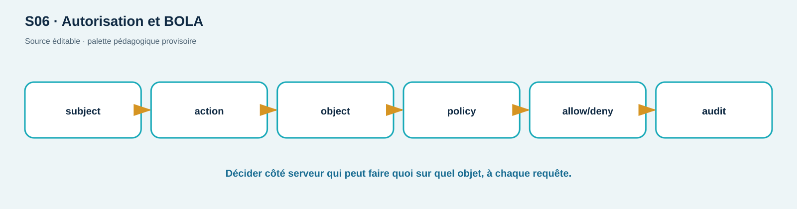

# TP03 — Corriger une BOLA et prouver 200/401/403

**Séance :** S06 · **Durée :** 180 min · **Compétence :** C06 · **Niveau :** intermédiaire

## Sécurité, objectifs et prérequis

Tests limités à ShopLab local. Les IDs 1 et 2 représentent Alice et Bob synthétiques. Vous devez distinguer authentification et autorisation, établir une matrice sujet/action/objet, reproduire BOLA, rédiger une correction au niveau objet et la retester. TP02 acquis.

## Livrables et réussite

Matrice d'autorisation, preuves `200/401/403`, diff de correction dans `starter-files/TP03`, test automatisé négatif et note de risque. La réussite exige : Alice→Alice `200`; anonyme→Bob `401`; Alice→Bob `403`; admin→Bob `200`.

## Mise en place (15 min)

```bash
cd labs/shoplab
./scripts/reset.sh
mkdir -p preuves/TP03
base=http://127.0.0.1:${SHOPLAB_HTTP_PORT:-8080}
```

Connectez Alice et admin avec les identifiants synthétiques documentés dans le README; extrayez les tokens en variables sans les afficher.

## A — Modèle d'autorisation (30 min)

Pour `GET /api/users/{id}`, listez sujets (anonyme, user, admin), objets (propre profil, profil tiers), action et décision. Précisez où doit se faire le contrôle et pourquoi masquer uniquement le bouton côté navigateur est insuffisant.

## B — Baseline vulnérable (35 min)

```bash
curl -sS -o /dev/null -w 'anon=%{http_code}\n' "$base/api/users/2"
curl -sS -o preuves/TP03/alice-own.json -w 'own=%{http_code}\n' \
  -H "Authorization: Bearer $alice_token" "$base/api/users/1"
curl -sS -o preuves/TP03/alice-bob.json -w 'other=%{http_code}\n' \
  -H "Authorization: Bearer $alice_token" "$base/api/users/2"
```

Expurgez les données de profil. Démontrez l'impact sans modifier Bob. Associez cause racine, actif, menace et contrôle absent.

## C — Correction apprenant (55 min)

Copiez le squelette `starter-files/TP03/authorization_policy.py`. Complétez une fonction pure qui reçoit le sujet, l'action et l'owner ID, renvoie une décision explicite et refuse par défaut. Écrivez quatre tests. Comparez ensuite votre décision avec le comportement `corrected` :

```bash
./scripts/set-mode.sh corrected
python3 ../../starter-files/TP03/test_authorization_policy.py
```

Ne considérez pas le changement de mode comme votre correction : le livrable principal est votre politique et ses tests. Discutez `403` contre `404` selon le risque d'énumération.

## D — Retest et journal (30 min)

Exécutez la matrice complète. Pour chaque ligne, capturez statut, taille et `X-Correlation-ID`, jamais le token. Vérifiez qu'un refus produit un événement d'autorisation exploitable sans données sensibles.

## Vérification et nettoyage (15 min)

```bash
./scripts/verify-lab.sh authz
./scripts/reset.sh
./scripts/cleanup.sh
```

## Dépannage

Un `401` partout indique un token absent/expiré; reconnectez-vous. Un `200` tiers en corrected signale généralement que vous utilisez le token admin. Ne modifiez pas les IDs en base. Sous PowerShell, stockez le header dans un hashtable et n'affichez pas sa valeur.

## Barème /20

| Critère | Insuffisant | Conforme | Maîtrisé | Pts |
| --- | --- | --- | --- | ---: |
| Modèle | rôles seuls | sujet/action/objet | deny-by-default et cas limites | 5 |
| Reproduction | assertion sans preuve | baseline bornée | risque relié à la cause | 4 |
| Correction | branche spéciale | fonction testée | politique réutilisable | 6 |
| Retest/preuves | happy path seul | 200/401/403/200 | logs et non-régression | 5 |

<!-- full-course-visual-runbooks -->

## Vue ShopLab avant de commencer



**Question du visuel :** où la donnée traverse-t-elle une frontière de confiance, quel composant décide et quel état doit être observé après l’action ?

| Élément | Lecture attendue |
| --- | --- |
| Zone étudiée | Sujet → API → décision objet → PostgreSQL |
| Direction | aller de la requête, puis retour statut/headers/corps/logs |
| Contrôle | placé au composant qui possède la décision, refus par défaut |
| État final | parcours légitime fonctionnel, cas négatif refusé, preuve expurgée |

## Bloc de commande important — méthode commune

1. **Goal** — observer ou modifier uniquement l’état annoncé pour `matrice 200/401/403`.
2. **Before** — noter mode ShopLab, commit, services et baseline.
3. **Command** — exécuter exactement la commande du bloc concerné sur `127.0.0.1` ou le réseau Docker isolé.
4. **What happens inside the system** — suivre le nœud actif dans le diagramme, puis la décision et la trace générée.
5. **Expected output** — prédire statut, champ ou branche avant d’exécuter; ne pas fabriquer une sortie.
6. **Small diagram or highlighted architecture** — entourer sur le visuel le composant qui change ou révèle son état.
7. **How to verify** — répéter le test négatif et le parcours légitime avec le même contexte documenté.
8. **Evidence to save** — avant/après + non-régression; UTC, commande, sortie minimale, conclusion et limite.
9. **If it fails** — arrêter si la cible sort du lab; sinon vérifier une seule frontière à la fois et consigner l’écart.
10. **Next step** — indexer la preuve, effectuer le debrief demandé, puis `reset`/`cleanup`.
