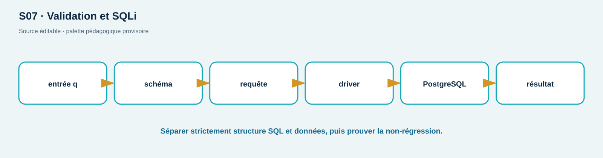

# TP04 — SQLi, XSS et CSRF : corriger puis retester

**Séances :** S07–S08 · **Durée :** 180 min · **Compétences :** C03, C07, C10 · **Niveau :** intermédiaire

## Contrat et objectifs

Payloads uniquement sur ShopLab local et données synthétiques; pas d'outil d'exploitation automatisé. Vous comparerez concaténation/paramétrage SQL, insertion HTML/encodage contextuel et requête d'état/jeton CSRF. La réussite exige un test positif, une correction au bon contexte, un test négatif et une non-régression fonctionnelle.

## Prérequis et livrables

TP01–TP03, lab sain, connaissance de HTTP/SQL/HTML. Remettez un tableau cause→sink→payload→impact→contrôle, trois paires avant/après, tests, extraits de code minimaux et preuves expurgées.

## Mise en place (10 min)

```bash
cd labs/shoplab
./scripts/reset.sh
base=http://127.0.0.1:${SHOPLAB_HTTP_PORT:-8080}
mkdir -p preuves/TP04
```

## A — Injection SQL (45 min)

Baseline fonctionnelle : `q=lamp` retourne un produit. Test local :

```bash
curl -sS --get --data-urlencode "q=' OR '1'='1" "$base/api/products" \
  > preuves/TP04/sqli-before.json
```

En mode vulnérable, plusieurs lignes prouvent la modification de la structure SQL. Étudiez le squelette `starter-files/TP04/query.py`, remplacez la concaténation par un paramètre driver, puis testez chaîne normale, apostrophe, payload et Unicode. En mode corrected, le payload doit retourner 0 ligne et `lamp` toujours 1.

## B — XSS réfléchi et contexte (40 min)

```bash
curl -sS --get --data-urlencode 'value=' \
  "$base/api/echo" > preuves/TP04/xss-before.html
./scripts/set-mode.sh corrected
curl -sS --get --data-urlencode 'value=' \
  "$base/api/echo" > preuves/TP04/xss-after.html
```

N'ouvrez la preuve que sur la machine du lab. Comparez texte brut et entités HTML. Expliquez pourquoi l'encodage HTML n'est pas automatiquement correct pour JavaScript, URL ou attribut. Relevez la CSP HTTPS et dites pourquoi elle est une défense en profondeur, pas la correction de la source.

## C — CSRF (40 min)

Utilisez la procédure TP02 sur `/api/profile/display-name`. Collectez les statuts sans/avec token en vulnerable puis corrected. Vérifiez également que le serveur refuse un `Origin` inattendu en mode corrigé. Distinguez token synchronisé/double-submit, SameSite et contrôle Origin.

## D — Tests de non-régression (25 min)

Ajoutez à votre starter des cas : recherche vide, apostrophe légitime, caractères `<>&`, token CSRF absent/faux/correct. Classez chaque assertion : sécurité ou fonctionnelle. Aucun correctif ne doit se réduire à une blacklist du payload montré.

## Vérification, reset et cleanup (20 min)

```bash
./scripts/verify-lab.sh injection
./scripts/verify-lab.sh session
./scripts/reset.sh
./scripts/cleanup.sh
```

## Dépannage

Encodez les paramètres avec `--data-urlencode`; ne collez pas le payload directement dans l'URL. Si le navigateur bloque une action, capturez aussi la réponse serveur : SOP/CSP et validation serveur ne sont pas le même contrôle. Sous PowerShell, préférez `curl.exe` pour conserver les options curl.

## Barème /20

| Critère | Insuffisant | Conforme | Maîtrisé | Pts |
| --- | --- | --- | --- | ---: |
| Analyse des sinks | payloads copiés | trois causes identifiées | contexte et limites | 5 |
| Corrections | blacklist | paramètre/encodage/CSRF | défense en profondeur | 7 |
| Retests | avant seulement | positif+négatif+fonctionnel | tests automatisés | 5 |
| Preuves/cycle | sensible/résidus | expurgé et cleanup | index reproductible | 3 |

<!-- full-course-visual-runbooks -->

## Vue ShopLab avant de commencer



**Question du visuel :** où la donnée traverse-t-elle une frontière de confiance, quel composant décide et quel état doit être observé après l’action ?

| Élément | Lecture attendue |
| --- | --- |
| Zone étudiée | Entrée → validation → sink SQL/HTML → réponse |
| Direction | aller de la requête, puis retour statut/headers/corps/logs |
| Contrôle | placé au composant qui possède la décision, refus par défaut |
| État final | parcours légitime fonctionnel, cas négatif refusé, preuve expurgée |

## Bloc de commande important — méthode commune

1. **Goal** — observer ou modifier uniquement l’état annoncé pour `payload local + correction`.
2. **Before** — noter mode ShopLab, commit, services et baseline.
3. **Command** — exécuter exactement la commande du bloc concerné sur `127.0.0.1` ou le réseau Docker isolé.
4. **What happens inside the system** — suivre le nœud actif dans le diagramme, puis la décision et la trace générée.
5. **Expected output** — prédire statut, champ ou branche avant d’exécuter; ne pas fabriquer une sortie.
6. **Small diagram or highlighted architecture** — entourer sur le visuel le composant qui change ou révèle son état.
7. **How to verify** — répéter le test négatif et le parcours légitime avec le même contexte documenté.
8. **Evidence to save** — sortie attendue + retest; UTC, commande, sortie minimale, conclusion et limite.
9. **If it fails** — arrêter si la cible sort du lab; sinon vérifier une seule frontière à la fois et consigner l’écart.
10. **Next step** — indexer la preuve, effectuer le debrief demandé, puis `reset`/`cleanup`.
