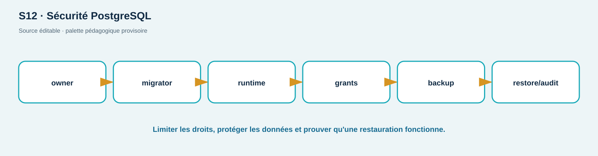

# TP07 — Moindre privilège DB, sauvegarde, pipeline et observabilité

**Séances :** S12–S13 · **Durée :** 180 min · **Compétences :** C10, C11, C12 · **Niveau :** avancé accompagné

## Contrat, objectifs et prérequis

Base et scanners du réseau Docker local uniquement; aucune donnée réelle. Vous créez des rôles minimaux dans une base jetable, prouvez backup/restore, exécutez tests/SAST/SCA/secrets avec décisions explicites, puis corrélez un événement. TP01–TP06 requis.

## Livrables et réussite

Matrice rôles/grants, transcript SQL expurgé, empreintes avant/après restauration, rapport de pipeline avec findings triés, exception datée si nécessaire et mini chronologie d'incident. Réussite : accès permis/refusé prouvé, restauration cohérente, gate ne transforme pas un finding en PASS, logs corrélables sans secret, cleanup complet.

## Mise en place (15 min)

```bash
cd labs/shoplab
./scripts/reset.sh
mkdir -p preuves/TP07
```

## A — Rôles et privilèges (35 min)

À partir de `starter-files/TP07/roles.sql`, définissez `shoplab_runtime` (SELECT/INSERT/UPDATE ciblés), `shoplab_readonly` (SELECT) et `shoplab_backup` (lecture nécessaire), sans superuser, création de rôle/base ni ownership. Exécutez dans la base jetable. Prouvez : lecture autorisée; `DROP TABLE` et lecture d'une table d'audit refusées au runtime; écriture refusée au readonly. N'enregistrez aucun mot de passe dans Git.

## B — Backup/restore vérifié (30 min)

Utilisez `pg_dump` dans le conteneur vers `.state/` ignoré, calculez SHA-256, restaurez dans une base temporaire du même projet, puis comparez nombre de lignes et contraintes. Une archive créée sans test de restauration n'est pas une preuve de sauvegarde. Supprimez base temporaire et archive lors du cleanup.

## C — Pipeline local (40 min)

```bash
./scripts/ci-security.sh | tee preuves/TP07/security-gate.txt
```

Le rapport sépare exécution de l'outil et résultat : `PASS`, `WARN` avec findings triés, `FAIL` d'exécution ou politique. Pour chaque finding réel, notez composant, version, exploitabilité locale, décision, propriétaire, échéance et contrôle compensatoire. Une exception doit être versionnée, précise et expirante; ne modifiez pas le seuil pour « faire vert ».

## D — Logs, métriques et incident (35 min)

Démarrez `observe`, déclenchez un login invalide puis un refus BOLA avec des `X-Correlation-ID` synthétiques. Recherchez événement, statut et compteur. Construisez une chronologie UTC de cinq lignes : signal, triage, hypothèse, correction, retest. Vérifiez l'absence de password/token/cookie dans les logs.

## E — Vérification et reset (20 min)

```bash
./scripts/verify-lab.sh database
./scripts/verify-lab.sh observability
./scripts/reset.sh
./scripts/cleanup.sh
```

Le script de runtime installe un trap qui appelle cleanup même si une assertion échoue. Vérifiez ensuite qu'aucun conteneur/volume du projet de test ne subsiste.

## Dépannage et limites de plateforme

Les images et bases peuvent exiger Internet au premier build; la séance elle-même utilise les images préchargées. Sur macOS/Windows, les volumes résident dans la VM Docker : utilisez `docker compose exec`, pas un chemin hôte supposé. Si SCA ne peut joindre son feed, classez `WARN: non évalué`, jamais PASS. L'observabilité complète est plus lourde (≥4 Gio recommandés); le fallback est le JSONL local documenté.

## Barème /20

| Critère | Insuffisant | Conforme | Maîtrisé | Pts |
| --- | --- | --- | --- | ---: |
| DB moindre privilège | compte propriétaire | allow/deny prouvés | ownership/audit séparés | 6 |
| Backup/restore | dump seul | restauration + intégrité | RPO/RTO/limites | 4 |
| DevSecOps | vert cosmétique | findings/erreurs séparés | exception gouvernée | 6 |
| Observabilité/cycle | logs bruts/résidus | corrélation + cleanup | chronologie et confidentialité | 4 |

<!-- full-course-visual-runbooks -->

## Vue ShopLab avant de commencer



**Question du visuel :** où la donnée traverse-t-elle une frontière de confiance, quel composant décide et quel état doit être observé après l’action ?

| Élément | Lecture attendue |
| --- | --- |
| Zone étudiée | Application → rôle PostgreSQL → gate CI → logs |
| Direction | aller de la requête, puis retour statut/headers/corps/logs |
| Contrôle | placé au composant qui possède la décision, refus par défaut |
| État final | parcours légitime fonctionnel, cas négatif refusé, preuve expurgée |

## Bloc de commande important — méthode commune

1. **Goal** — observer ou modifier uniquement l’état annoncé pour `GRANT/REVOKE + gate`.
2. **Before** — noter mode ShopLab, commit, services et baseline.
3. **Command** — exécuter exactement la commande du bloc concerné sur `127.0.0.1` ou le réseau Docker isolé.
4. **What happens inside the system** — suivre le nœud actif dans le diagramme, puis la décision et la trace générée.
5. **Expected output** — prédire statut, champ ou branche avant d’exécuter; ne pas fabriquer une sortie.
6. **Small diagram or highlighted architecture** — entourer sur le visuel le composant qui change ou révèle son état.
7. **How to verify** — répéter le test négatif et le parcours légitime avec le même contexte documenté.
8. **Evidence to save** — matrice privilèges + branche pass/fail; UTC, commande, sortie minimale, conclusion et limite.
9. **If it fails** — arrêter si la cible sort du lab; sinon vérifier une seule frontière à la fois et consigner l’écart.
10. **Next step** — indexer la preuve, effectuer le debrief demandé, puis `reset`/`cleanup`.
